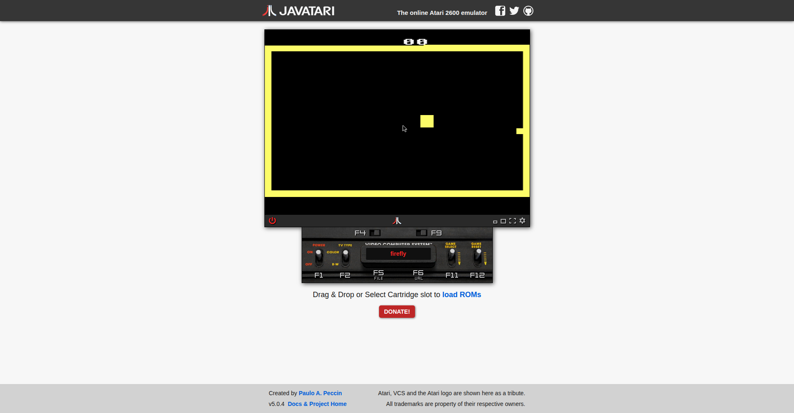
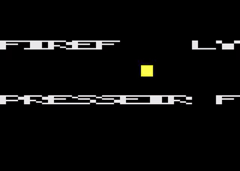

# FIREFLY — Atari 2600

A minimal, clean Atari 2600 proof-of-concept game — now with a chaser enemy and multi-room progression. Built as a starting point for new Atari 2600 homebrew projects.





## What it does

- **Title screen**: `FIREFLY` block text, blinking yellow firefly dot, blinking `PRESS FIRE`
- **Gameplay**: Press fire to start (plays a 3-note start jingle). Joystick moves the blinking firefly around a walled playfield. The firefly stops exactly at the walls — touching them, never overlapping or stopping short.
- **Embers & score**: A blinking ember (missile 0) appears at a random spot. Fly into it to collect it for **+1** — with a collect sound blip — the score (00–99, BCD) shows at the top of the screen in TIA score mode, and a new ember spawns elsewhere.
- **The shade**: A ghost sprite (player 1) hunts you. It moves toward you one step at a time, and every 4 points it gets faster — shifting from blue to purple to red to orange to white-hot as it speeds up. If it touches you: red flash, falling death buzz, back to the title screen.
- **Rooms & the door**: Collect enough embers in a room (5 in room 1, 6 in room 2, …) and a door chime plays as a 24px gap opens in the bottom wall. Fly down through it to escape to the next room — new wall color, faster shade, more embers needed. How deep can you go?
- **Power ember & freeze**: After your 2nd ember in a room, a white-blue **power ember** (missile 1) spawns alongside the regular one — risk/reward: chase the score, grab the power, or ignore it. Collect it to gain the **freeze power** (score blinks as the indicator). Press FIRE to freeze the shade solid for 3 seconds (icy blue, can't move). Use it or lose it — it resets every room.
- **Audio**: TIA SFX (collect blip, power-up zap, door chime, rising room-fanfare scale, death buzz, start jingle) via `AUDC0`/`AUDF0`/`AUDV0`

## Files

- `firefly.asm` — full 6502 assembly source (DASM syntax)
- `firefly.bin` — assembled 4K ROM, ready to run in Stella, RetroArch, or real hardware

## Building

You need [DASM](https://dasm-assembler.github.io/):

```bash
dasm firefly.asm -f3 -ofirefly.bin
# ensure exactly 4096 bytes with vectors at $FFFA-$FFFF
```

## How it works

- **Kernel**: 262-scanline frame (3 VSYNC + 37 VBLANK + 192 playfield + 30 overscan)
- **Title**: playfield text via a 4px block font, ball sprite for the firefly dot
- **Game**: ball sprite (8px, `CTRLPF=$31`) for the firefly, missile 0 (4px, `NUSIZ0=$20`) for the ember, player 1 (8×8 ghost sprite) for the shade, playfield for the wall border
- **4-object kernel**: ball/firefly, ember (M0), shade (P1), and power ember (M1) are Y-sorted in VBLANK into draw slots; a layout pass pushes overlapping objects down and precomputes exact blank gaps so the middle is always exactly 168 lines
- **Shade repositioning**: player 1 is positioned in VBLANK for the score ones digit, then repositioned mid-kernel during the top-wall lines for the shade (other motion registers cleared so the extra `HMOVE` only moves the shade)
- **Score**: BCD 00–99 in zero page, `sed`/`adc #1` on collect, digit pointers computed in VBLANK, drawn in 8 score-mode lines at the top of the kernel (`CTRLPF=$02`; in score mode the player digits take `COLUP0`/`COLUP1` — not `COLUPF` — so all three are set white)
- **Shade AI**: frame-skipped chase (1px toward player per tick); tick rate from a level table driven by `Points/4 + Room - 1` (capped); color from a blue→white heat table
- **Rooms**: `RoomScore >= 4+Room` opens the door (`PF2=$F8` clears a centered 24px gap in the bottom wall, mirrored); flying below the wall inside the shaft triggers `NextRoom`
- **RNG**: 8-bit LFSR (`eor #$B4`) for ember spawn positions
- **Collision**: software distance checks — simpler and more predictable than the TIA collision latches here
- **Input**: `SWCHA` joystick, `INPT4` fire button
- **Positioning**: classic divide-by-15 `PosX` routines with `HMOVE` fine adjust

## Lessons baked in

This ROM was debugged the hard way — see the dev.to article for the full story:
- The TIA ball/player must be drawn for a bounded set of scanlines; enabling it across all 192 lines can glitch
- `BlankLines`-style helpers must handle a zero count (X=0 loops 256 times with `dex`/`bne`!)
- Clear TIA motion registers (`HMCLR`) when switching screens or you get phantom artifacts
- Clamp positions *before* drawing, and guard `dec`/`inc` against wraparound instead of clamping after
- Border clamps must match the sprite's drawn width: an 8px ball at X occupies pixels X..X+7, so against 4px walls at 0-3 and 156-159 the correct X range is 4..148
- One hardware sprite can't be in two places in one frame: player 1 draws the score digit (positioned in VBLANK) *and* the shade (repositioned mid-kernel during the top wall, with other `HMxx` cleared before the second `HMOVE`)

## License

Public domain. Do whatever you want with it.
